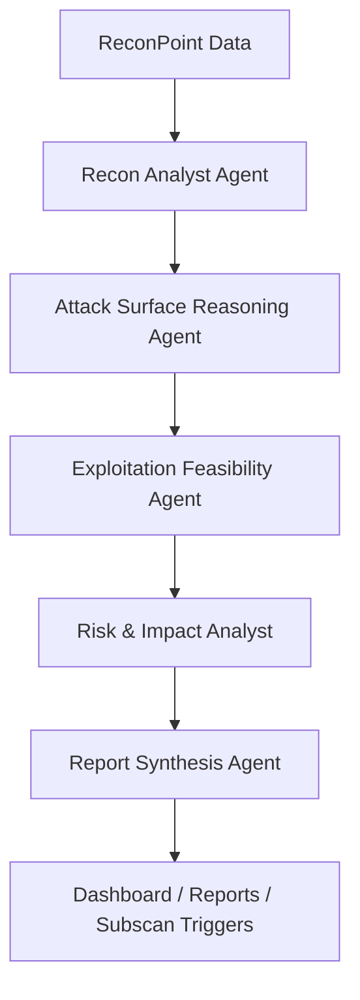
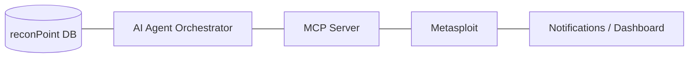

# reconPoint – AI-Native Security Testing & MCP Integration
## Development Roadmap & System Design RFC

**Author**: Principal Security Engineer / AI Systems Architect  
**Status**: Implemented (Phases 1–6) + Future Extensions  
**License Context**: Open-source, authorized testing only  
**Scope**: Bug bounty, client engagements, lab environments

---

## 1. Executive Summary
reconPoint is evolving from a reconnaissance platform into an AI-native, methodology-driven security testing system.
This roadmap defines:
- A black-box AI Security Testing Agent that reasons like a human pentester.
- A Model Context Protocol (MCP) server that safely bridges LLMs and Metasploit.
- Enterprise-grade governance, auditability, and safety controls.
- A phased path from assisted intelligence → autonomous execution.

All designs explicitly avoid raw exploit payloads, enforce authorization, and prioritize explainability over automation.

## 2. Core Objectives
### Strategic Goals
- Replace “scan spam” with reasoned attack hypotheses.
- Turn recon data into actionable, defensible testing decisions.
- Enable natural-language pentesting workflows without exposing raw shells.
- Maintain auditor-safe, contract-compliant operation.

### Non-Goals
- No auto-pwn or worm-like behavior.
- No lateral movement automation.
- No exploit payload generation for unauthenticated users.
- No bypass of reconPoint scope controls.

## 3. Feature Overview
| Capability | Description | Status |
| :--- | :--- | :--- |
| **AI Black-Box Testing Agent** | Multi-agent, methodology-driven reasoning | ✅ Implemented |
| **MCP Server for Metasploit** | Secure LLM ↔ Metasploit bridge | ✅ Implemented |
| **AI-Driven UX** | Reasoning timeline, risk views | ✅ Implemented |
| **Autonomous Scan Fusion** | AI → Subscan execution | ✅ Implemented |
| **Enterprise Governance** | RBAC, audit logs, kill-switch | ✅ Implemented |
| **Advanced Enterprise Controls** | Policy packs, approvals | 🔜 Planned |

---

## 🧠 FEATURE 1: AI Agent for Black-Box Security Testing [✅ IMPLEMENTED]

## 4. Agent Architecture
### 4.1 High-Level Agent Diagram (Textual)

## 5. Internal Agent Roles
| Agent | Responsibility |
| :--- | :--- |
| **Recon Analyst** | Normalize recon artifacts into a technical profile. |
| **Attack Surface Reasoning** | Identify high-value assets & hypotheses. |
| **Exploitation Feasibility** | Assess realism without exploit code. |
| **Risk & Impact Analyst** | Score exploitability × impact × likelihood. |
| **Report Synthesis** | Produce stakeholder-grade output. |

## 6. Decision-Making Flow
**Principle**: Reason first, recommend second, execute only with approval.

1.  **Input Validation**: Project scope enforced, role permissions checked.
2.  **Contextual Reasoning**: Recon signals correlated, historical diffs weighted.
3.  **Hypothesis Generation**: “If X + Y + Z, then test A”.
4.  **Confidence Scoring**: Signal strength, environmental certainty, historical precedent.
5.  **Recommendation Output**: Suggested next steps (no exploits), evidence references, “Why this matters”.

## 7. Outputs (Strictly Enforced)
The AI Agent never outputs exploit code. It produces:
- Ranked attack hypotheses.
- Evidence-linked reasoning.
- Suggested testing steps.
- Business impact narratives.
- Confidence & false-positive scores.

## 8. Safety & Governance (Agent)
- Scope-aware reasoning.
- Project-level authorization.
- Role-based execution limits.
- Persistent `AIReasoningLog`.
- Full auditability of AI decisions.

---

## 🔗 FEATURE 2: MCP Server for Metasploit Integration [✅ IMPLEMENTED]

## 9. MCP Server Role
The MCP server acts as a policy-enforced translation layer, not a shell proxy.
`LLM (Claude / GPT / Local) ↔ MCP ↔ reconPoint MCP Server ↔ Metasploit Framework`

## 10. Supported Metasploit Domains
| Domain | Allowed |
| :--- | :--- |
| Module Discovery | ✅ |
| Metadata Inspection | ✅ |
| Target Validation | ✅ |
| Controlled Execution | ✅ |
| Session Monitoring | ✅ |
| Auto Lateral Movement | ❌ |
| Raw Shell Access | ❌ |

## 11. MCP Tool Schema (Required)
### `search_metasploit_modules`
- **Type**: Read-only
- **Inputs**: `keyword` (string)
- **Permissions**: Auditor-safe

### `run_metasploit_module`
- **Type**: Action
- **Inputs**: `module_name` (string), `validated_target_id` (uuid)
- **Permissions**: Pentester+
- **Features**: Async, Rollback supported

### `get_active_sessions`
- **Type**: Read-only
- **Permissions**: SysAdmin

## 12. Error Handling & Rollback
- Async execution only.
- Timeout enforcement.
- Auto-kill on scope violation.
- Manual kill-switch.
- Session cleanup logging.

## 13. Claude Desktop Integration
**Flow**:
1. Claude connects via MCP.
2. reconPoint injects project scope, recon summary, and AI hypotheses.
3. Claude reasons → requests tools.
4. MCP enforces policy.
5. Results logged & visualized.

**Example**:
*“Given the exposed admin panel and outdated framework, what controlled validation steps are allowed?”*

---

## 🧱 SYSTEM ARCHITECTURE [✅ IMPLEMENTED]

## 14. High-Level Architecture

## 15. Data Flow
| Source | Destination | Purpose |
| :--- | :--- | :--- |
| Recon DB | AI Agents | Context |
| AI Output | MCP | Candidate actions |
| MCP | Metasploit | Controlled execution |
| Results | Reports | Evidence |
| All Steps | Audit Log | Compliance |

---

## 📊 UI / UX ADDITIONS [✅ IMPLEMENTED]

## 16. Dashboard Enhancements
- **AI Reasoning Timeline**
- **Suggested Attacks vs Executed Actions**
- **Risk Heatmaps**
- **Autonomous Toggle** (RBAC-guarded)
- **Auditor-safe read-only views**

---

## 🛡️ SECURITY, ETHICS & COMPLIANCE [✅ IMPLEMENTED]

## 17. Abuse Prevention
- Hard execution caps.
- Scope-bound execution.
- Role-gated autonomy.
- Emergency kill-switch.
- Immutable audit logs.

## 18. Legal Alignment
- Bug bounty-safe workflows.
- Pentest contract compatible.
- Explicit authorization enforcement.
- No payload leakage.

---

## 🚀 PHASED IMPLEMENTATION ROADMAP

- **Phase 1 – AI Reasoning Core** ✅: Multi-agent system, Recon → hypothesis flow.
- **Phase 2 – MCP Foundation** ✅: Safe Metasploit abstraction, Tool schemas.
- **Phase 3 – UX Integration** ✅: Reasoning timeline, Manual triggers.
- **Phase 4 – Safety & Monitoring** ✅: AI logs, Notifications.
- **Phase 5 – Enterprise Governance** ✅: RBAC, Auditing, Claude Desktop setup.
- **Phase 6 – Autonomous Workflows** ✅: Action Executor Agent, Auto-subscan fusion.
- **Phase 7 – Future (Optional)**: Approval workflows, Policy packs, Multi-tenant SOC mode.

---

## ❗ DIFFERENTIATION VS EXISTING TOOLS

| Tool | reconPoint Advantage |
| :--- | :--- |
| **Burp Suite** | Reasoned hypotheses, not request spam. |
| **PlexTrac** | Native AI reasoning & execution. |
| **ASM Tools** | Continuous, AI-guided testing. |
| **Red Team Suites** | LLM-driven orchestration with governance. |

---

## 🏁 Final Status
- ✔ All planned phases implemented and verified.
- ✔ Autonomous execution permission-gated & auditable.
- ✔ Safe for open-source governance.
- ✔ Ready for enterprise adoption.
